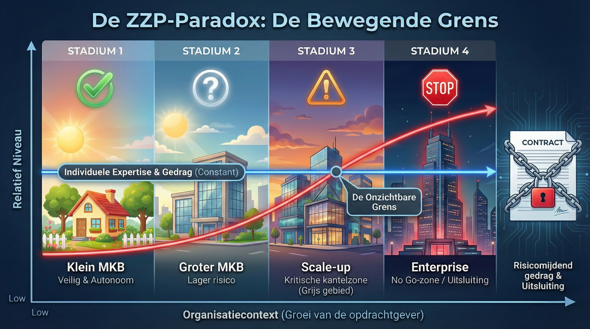

# DE ARCHITECTUUR VAN RECHTSZEKERHEID IN DE KENNISECONOMIE
### *Waarom de wet de status van zelfstandigen vooraf niet kan garanderen*

Deze repository bevat een **onafhankelijke, systematische analyse** van waarom het debat over schijnzelfstandigheid al decennia vastloopt. Het document toont aan waarom nieuwe wetgeving en beleidsmaatregelen binnen het bestaande kwalificatiekader telkens tegen dezelfde structurele grenzen aanlopen.

De analyse laat zien hoe dezelfde professionele inzet juridisch anders kan worden beoordeeld wanneer context en tijd veranderen, buiten de invloed van de zelfstandige. Dat verklaart terugkerende effecten in de praktijk: risicomijding, extra schakels in de keten en marktuitsluiting.

**Auteur:** Harrie de Groot • Software Architect • MSc AI  
**Status:** Versie 1.0 — Onafhankelijke Systeemdiagnose  
**Datum:** 16 februari 2026  

---

### 📑 Directe Toegang (PDF)

Deze editie biedt de volledige systeemdiagnose. Het document bevat de integrale bewijslast achter de ZZP-paradox en ontsluit de bronset via de **Evidence Map**.

| Document | Focus | Leestijd |
| --- | --- | --- |
| ⚡ **[Policy Brief](brief/policy-brief-v1.0.pdf)** | De kern en de ZZP-paradox | 60 sec |
| 📄 **[Decision Memo](brief/decision-memo-v1.0.pdf)** | Samenvatting voor beslissers | 3 min |
| 📚 **[Canonieke PDF](whitepaper/zzp-paradox-v1.0.pdf)** | Volledige analyse incl. Evidence Map | 15+ min |

---

### ✨ Interactieve Navigatie

Voor een snelle verkenning van de materie kan gebruik worden gemaakt van de interactieve AI-omgeving.

💬 Chat | 🎙️ Audio Briefing | 📊 Infographics | 🎬 Video-uitleg | 📄 Briefings | ...  

👉 **[Open de interactieve leeswijzer](https://notebooklm.google.com/notebook/0701dfb0-2615-42ec-b946-b7d0c3ce0ba9)**

*Let op: NotebookLM dient als navigatiehulp. Citeer en verifieer altijd in de canon-PDF.*

---

### 🛑 Disclaimer

> Dit document is een **analytische systeemdiagnose**. 
>   
> Het is opgesteld als een onafhankelijk instrument om de voorspelbaarheid van wetgeving te toetsen. Het is nadrukkelijk geen juridisch advies, geen beleidsaanbeveling of politiek pamflet. De focus ligt op de architecturale uitvoerbaarheid van rechtszekerheid vooraf.

---

### 🔍 De ZZP-paradox

Centraal staat dat een werkrelatie juridisch kan kantelen zonder dat de zelfstandige aantoonbaar anders gaat leveren, maar doordat de organisatiecontext van de opdrachtgever verandert. Het document noemt dit de **ZZP-paradox**.

Door de professionele inzet in de analyse constant te houden, wordt zichtbaar waarom rechtszekerheid vooraf in complexe, kennisintensieve omgevingen structureel onder druk komt te staan. Verplichte processen, protocollen en tooling zijn daar vaak een uitvoeringsvoorwaarde om resultaat te leveren, maar kunnen vooraf worden geïnterpreteerd als ‘gezag’ of ‘inbedding’.

### 🖼️ Zie voor de volledige toelichting: [Projectpagina](https://harriedegroot.github.io/zzp-paradox/).
  
---

### 🎯 Toetsing & Conclusie

Het model daagt het huidige stelsel uit met twee fundamentele toetsvragen:

1. **Centrale Toetsvraag:** “Kan binnen de huidige regels vooraf het kantelpunt worden aangewezen waarop dezelfde opdracht juridisch omslaat naar een dienstbetrekking, uitsluitend doordat de opdrachtgever groeit en strakker gaat organiseren, terwijl de zelfstandige professional aantoonbaar dezelfde inzet levert?”
   
2. **Aanvullende Toetsvraag:** “Hoe kan een zelfstandige efficiënt leveren in dynamische, kennisintensieve omgevingen waar integratie in processen en tooling een uitvoeringsvoorwaarde is, zonder dat noodzakelijke afstemming daarbij als ‘gezag’ of ‘ondergeschiktheid’ wordt beoordeeld?”

---

### 🛠️ Support & Audit-protocol

Voor vragen over systematiek, onafhankelijkheid of voor een inhoudelijke bijdrage aan de audit: raadpleeg de **[Support Hub](./support/README.md)**.

* **Inhoudelijke Toetsing**: reacties zijn uitsluitend auditbaar indien voorzien van een bronanker uit de canonieke PDF (sectie (x.x.x) + exacte quote).
* **Feedback indienen**: [Gebruik dit formulier](https://github.com/harriedegroot/zzp-paradox/issues/new?template=audit.yml) (GitHub Issues) voor inhoudelijke feedback.
* **Scope**: Geen beoordeling van individuele dossiers of contracten, maar behandeling van errata, vragen en mechanisme-tegenvoorbeelden.

---

### 📢 Disclosure & Integriteit

- **Onafhankelijkheid:** individuele uitgave zonder opdrachtgever, sponsor of lobby-achtergrond.
- **AI-verantwoording:** NotebookLM is een publieke navigatiehulp; output is nooit canoniek en kan fouten bevatten.
- **Misquote-kit:** richtlijnen voor correctie van onjuiste weergaves staan in [NOTES](./support/NOTES.md).
---

### ⚖️ Licenties, Integriteit & Verificatie

**Citeerregel:** citeer uitsluitend de canonieke PDF met sectie (x.x.x) en exacte quote (bronanker).

Dit project hanteert een gesplitste licentiestructuur:  

- **Inhoud (PDF's):** [LICENSE-PDFS](./LICENSE-PDFS.md) (vrij delen, geen wijzigingen).
- **Visuals:** [LICENSE-VISUALS](./LICENSE-VISUALS.md) (vrij delen en bewerken).
- **Code:** [LICENSE](LICENSE) (vrij technisch hergebruik).
  
Om de integriteit van deze publicatie te waarborgen, zijn de PDF-bestanden voorzien van een SHA256 checksum.   **Verificatie:** Vergelijk de hash van uw bestand met de waarden in [CHECKSUMS](./CHECKSUMS.txt).
  
---
© 2026 Harrie de Groot | [Projectpagina](https://harriedegroot.github.io/zzp-paradox/)